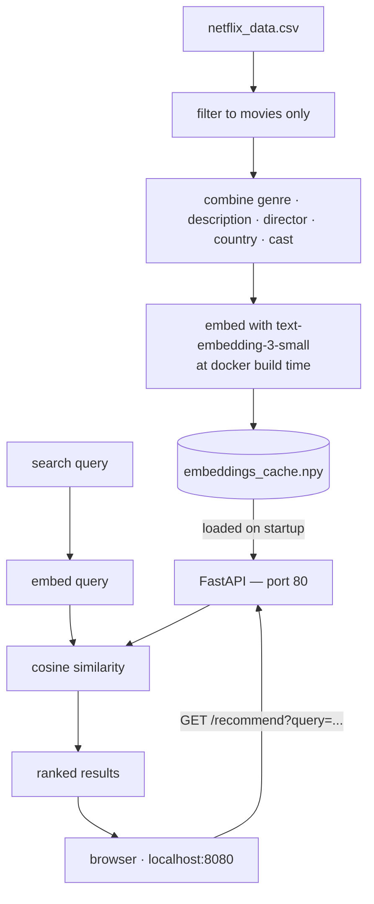
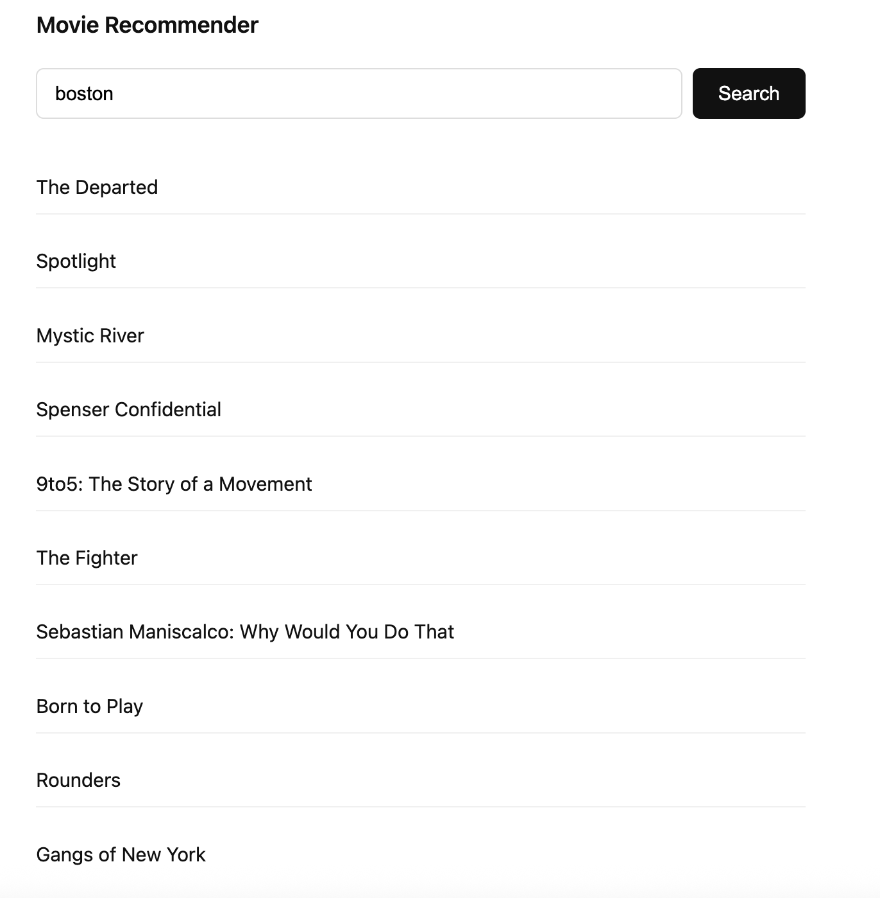

# Movie Recommendation System

Search the Netflix movie catalog using plain English. Type something like "funny sci-fi with aliens" and get back ranked matches based on meaning, not just keywords.

---

## Architecture

The diagram below shows how data flows from the CSV through the recommendation engine to the browser.



During `docker build` the catalog gets embedded once and saved to a `.npy` file inside the image, so the server starts instantly. At request time the query gets embedded with the same model and scored against the cached matrix.

---

## AI Setup

- **Provider:** OpenAI
- **Model:** `text-embedding-3-small`

You need your own OpenAI API key to run this. Create a `.env` file in the project root before building:

```bash
cp .env.example .env
```

Open `.env` and fill in your key:

```
OPENAI_API_KEY=sk-...
```

The key is used during `docker build` to embed the movie catalog (one-time cost, under $0.01) and at runtime to embed each search query. You can create or find your API key at https://platform.openai.com/api-keys.

---

## Approach

The recommender uses semantic embeddings rather than keyword matching. The problem with keyword search is that a query like "feel-good movie about friendship" won't match a film described as "two strangers form an unlikely bond" — same idea, different words.

Instead, each movie's genre, description, director, country, and cast are combined into a single string and passed through `text-embedding-3-small`, which converts it into a vector that captures meaning. All vectors are stored at build time.

When you search, your query goes through the same model. The result is compared against every movie vector using cosine similarity — movies whose meaning is closest to your query rank highest. There's no query parsing or special handling; the model takes care of interpreting things like mood, genre, setting, or character type in one pass.

---

## Demo



---

## Running

```bash
cp .env.example .env   # add your OPENAI_API_KEY
docker build -t movie-recommender .
docker run -p 8080:80 movie-recommender
```

Open http://localhost:8080. The first build takes around a minute to embed the catalog. After that, rebuilding with the same CSV skips the embedding step entirely.

## API

```
GET /recommend?query=funny sci-fi with aliens&top_k=5
```

```json
{
  "query": "funny sci-fi with aliens",
  "count": 5,
  "results": [
    { "title": "...", "description": "...", "score": 0.421 },
    ...
  ]
}
```

`top_k` defaults to 10, max 50. Empty query returns a 400.
