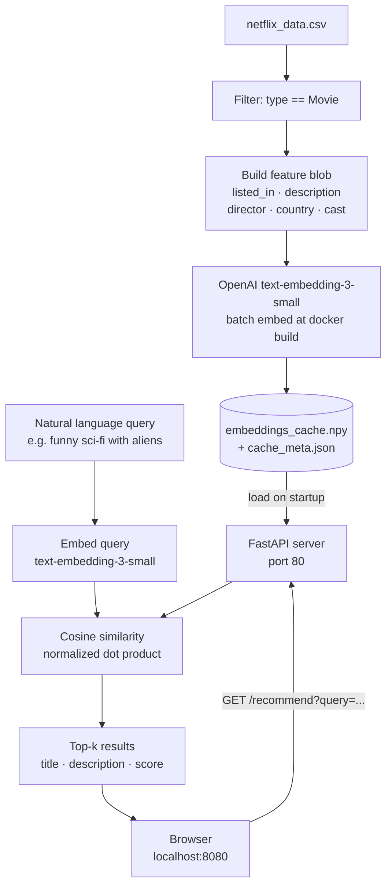

# Movie Recommendation System

A content-based movie recommender powered by OpenAI embeddings. Describe what you want to watch in plain English and get ranked results from the Netflix movie catalog.

---

## Architecture



**Build-time path (top row):** the CSV is ingested once during `docker build`, filtered to movies, converted to feature blobs, and embedded in bulk. The resulting matrix is saved as a `.npy` file baked into the image — no re-embedding on container restart.

**Request-time path (bottom row):** the browser sends a query string, the server embeds it with the same model, runs a single matrix–vector multiply against the pre-loaded corpus, and returns ranked JSON.

---

## AI Setup

| | |
|---|---|
| **Provider** | OpenAI |
| **Model** | `text-embedding-3-small` |
| **Used for** | Corpus embedding (build time) and query embedding (request time) |

Before building the image, create a `.env` file in the project root:

```bash
cp .env.example .env
```

Open `.env` and set your key:

```
OPENAI_API_KEY=sk-...
```

The key is used in two places:
- **`docker build`** — sources `.env` via `set -a && . ./.env` to embed the full movie catalog
- **`docker run`** — `load_dotenv()` reads `.env` at server startup for per-query embedding

You will be charged for the initial bulk embedding (~6 k titles × 1 536 dimensions). At April 2025 pricing this is under $0.01. Query-time calls are one embedding each.

---

## Approach

### Why embeddings instead of keyword search

Traditional keyword search (TF-IDF, BM25) requires the query to share vocabulary with the document. A query like *"heartwarming story about a dog"* would miss a film whose description says *"a loyal companion helps a grieving family heal"* — same concept, no overlapping tokens.

`text-embedding-3-small` maps both the query and every movie's feature blob into the same 1 536-dimensional semantic space, so proximity in that space reflects meaning rather than exact word overlap.

### Feature representation

Each movie is represented by a single text blob concatenated from five columns:

```
listed_in · description · director · country · cast
```

Title is intentionally excluded — it would reward exact-name matches and hurt discovery. The blob is embedded once and the vector is stored; the raw text is discarded after build.

### Similarity scoring

All corpus vectors are L2-normalized at load time. At query time:

1. The query string is embedded and normalized to a unit vector.
2. Similarity scores are computed as `embeddings_matrix @ query_vector` — a single BLAS dot-product operation, equivalent to cosine similarity because both sides are unit vectors.
3. Results below a minimum threshold (`MIN_SCORE = 0.20`) are dropped, so low-confidence matches are never returned.
4. The top-k remaining results are returned sorted by score descending.

### Natural language handling

No query parsing or intent detection is applied. The embedding model handles it implicitly — genre words, mood descriptors, plot keywords, actor names, and thematic language all influence the query vector in the same pass. Queries like *"90s action movie with a one-liner-heavy hero"* or *"slow burn psychological thriller"* work without any preprocessing.

---

## Demo

> **Add a screenshot here before submitting.**
>
> Suggested steps:
> 1. Build and run the container (see Quickstart below)
> 2. Open `http://localhost:8080`, type a query, hit Search
> 3. Take a screenshot and save it to `docs/demo.png`
> 4. Replace this block with: ``

---

## Quickstart

```bash
# 1. Add your OpenAI key
cp .env.example .env
# set OPENAI_API_KEY=sk-... in .env

# 2. Build (embeds the catalog — takes ~1 min on first run)
docker build -t movie-recommender .

# 3. Run
docker run -p 8080:80 movie-recommender
```

Open [http://localhost:8080](http://localhost:8080).

## API

`GET /recommend?query=<string>&top_k=<int>`

```
GET /recommend?query=funny+sci-fi+with+aliens&top_k=5
```

```json
{
  "query": "funny sci-fi with aliens",
  "count": 5,
  "results": [
    { "title": "The Hitchhiker's Guide to the Galaxy", "description": "...", "score": 0.421 },
    ...
  ]
}
```

| Parameter | Type | Default | |
|-----------|------|---------|---|
| `query` | string | — | required |
| `top_k` | int | 10 | 1–50 |

Returns `400` with `{ "detail": "..." }` if the query is empty.
